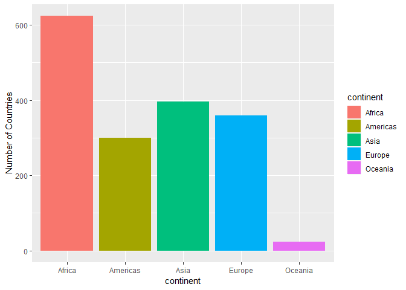
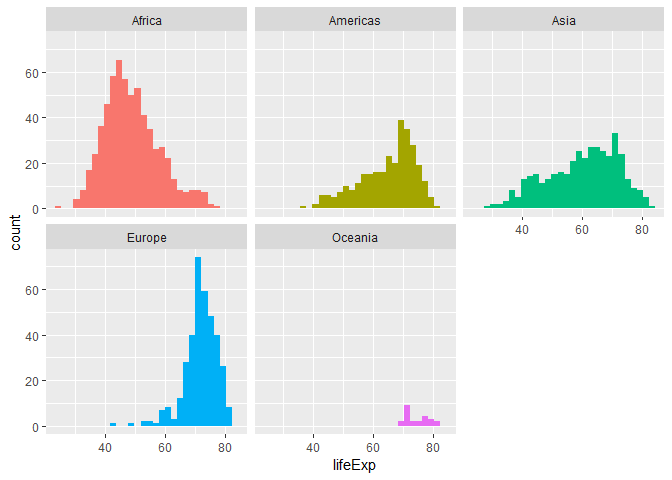

STAT545 Assignment 2
================
Alex
September 24, 2018

Initializing Gapminder Dataset and Libraries
--------------------------------------------

``` r
library(tidyverse)
library(ggplot2)
library(gapminder)

# these two packages help make very pretty tables
library(knitr)
library(kableExtra)
```

"Smell test" the data
---------------------

``` r
typeof(gapminder)
```

    ## [1] "list"

The gapminder object is a list.

``` r
class(gapminder)
```

    ## [1] "tbl_df"     "tbl"        "data.frame"

It's class is a tibble, which is a type of data frame.

``` r
dim(gapminder)
```

    ## [1] 1704    6

Using the`dims()` function we get that there are 1706 rows (observations) for 6 columns (variables). We could also get size information using the `ncol()` or `nrow()` functions

``` r
summary(gapminder)
```

    ##         country        continent        year         lifeExp     
    ##  Afghanistan:  12   Africa  :624   Min.   :1952   Min.   :23.60  
    ##  Albania    :  12   Americas:300   1st Qu.:1966   1st Qu.:48.20  
    ##  Algeria    :  12   Asia    :396   Median :1980   Median :60.71  
    ##  Angola     :  12   Europe  :360   Mean   :1980   Mean   :59.47  
    ##  Argentina  :  12   Oceania : 24   3rd Qu.:1993   3rd Qu.:70.85  
    ##  Australia  :  12                  Max.   :2007   Max.   :82.60  
    ##  (Other)    :1632                                                
    ##       pop              gdpPercap       
    ##  Min.   :6.001e+04   Min.   :   241.2  
    ##  1st Qu.:2.794e+06   1st Qu.:  1202.1  
    ##  Median :7.024e+06   Median :  3531.8  
    ##  Mean   :2.960e+07   Mean   :  7215.3  
    ##  3rd Qu.:1.959e+07   3rd Qu.:  9325.5  
    ##  Max.   :1.319e+09   Max.   :113523.1  
    ## 

``` r
class(gapminder$country)
```

    ## [1] "factor"

``` r
class(gapminder$continent)
```

    ## [1] "factor"

``` r
class(gapminder$year)
```

    ## [1] "integer"

``` r
class(gapminder$lifeExp)
```

    ## [1] "numeric"

``` r
class(gapminder$pop)
```

    ## [1] "integer"

``` r
class(gapminder$gdpPercap)
```

    ## [1] "numeric"

Using `summary()` we can get a quick overview of the variables in *gapminder* and surmise the data type of each variable, but we can also make sure by calling the `class()` function.

From this we get the following data types in *gapminder*:

| Variable  | Data Type |
|-----------|-----------|
| country   | factor    |
| continent | factor    |
| year      | integer   |
| lifeExp   | numeric   |
| pop       | integer   |
| gdpPercap | numeric   |

Exploring Individual Variable
-----------------------------

### Categorical Variable

Let's look at some details about the `continent` variable:

``` r
summary(gapminder$continent)
```

    ##   Africa Americas     Asia   Europe  Oceania 
    ##      624      300      396      360       24

The possible values are `Africa, America, Asia, Europe, and Oceania`.

Most countries exist in Africa, while the least countries exist in Oceania. Below is a plot of the number of countries in each continent:

``` r
gapminder %>%
  ggplot(aes(continent)) +
  geom_bar(aes(fill = continent)) + 
  labs(y = "Number of Countries")
```



### Quantitative Variable

Let's look at some details about the `lifeExp` variable. This variable tells us the life expectancy of a certain population of a country for a specific year.

``` r
summary(gapminder$lifeExp)
```

    ##    Min. 1st Qu.  Median    Mean 3rd Qu.    Max. 
    ##   23.60   48.20   60.71   59.47   70.85   82.60

A quick summary tells us the mean lifeExp over all countries is 59.47 years, and that the lifeExp variable ranges between 23.6 and 82.6 years. Below is the distribution of lifeExp in different continents:

``` r
gapminder %>%
  ggplot(aes(lifeExp)) +
  geom_histogram(aes(fill = continent)) +
  facet_wrap( ~ continent) + # allows us to make a separate histogram for each continent
  guides(fill=FALSE) # remove the legend as it is largely redundant after facetting
```



Let's calculate at the mean and standard deviation lifeExp of each continent. The function `aggregate()` allows us to apply a function to each column of a sub dataframe that we specify:

``` r
a <- aggregate(gapminder$lifeExp ~ gapminder$continent, FUN=mean) # this is to save our output into a matrix so that we can make it into a nice table
b <- aggregate(gapminder$lifeExp ~ gapminder$continent, FUN=sd)
a[3] <- b[2]
a %>%
  kable(col.names = c("Continent", "Mean Life Exp (Yrs)", "SD Life Exp (Yrs)"),"html") %>% #col.names inside kable() alows us to rename our columns
  kable_styling(bootstrap_options = c("striped", "hover", "condensed"), full_width = F)
```

<table class="table table-striped table-hover table-condensed" style="width: auto !important; margin-left: auto; margin-right: auto;">
<thead>
<tr>
<th style="text-align:left;">
Continent
</th>
<th style="text-align:right;">
Mean Life Exp (Yrs)
</th>
<th style="text-align:right;">
SD Life Exp (Yrs)
</th>
</tr>
</thead>
<tbody>
<tr>
<td style="text-align:left;">
Africa
</td>
<td style="text-align:right;">
48.86533
</td>
<td style="text-align:right;">
9.150210
</td>
</tr>
<tr>
<td style="text-align:left;">
Americas
</td>
<td style="text-align:right;">
64.65874
</td>
<td style="text-align:right;">
9.345088
</td>
</tr>
<tr>
<td style="text-align:left;">
Asia
</td>
<td style="text-align:right;">
60.06490
</td>
<td style="text-align:right;">
11.864532
</td>
</tr>
<tr>
<td style="text-align:left;">
Europe
</td>
<td style="text-align:right;">
71.90369
</td>
<td style="text-align:right;">
5.433178
</td>
</tr>
<tr>
<td style="text-align:left;">
Oceania
</td>
<td style="text-align:right;">
74.32621
</td>
<td style="text-align:right;">
3.795611
</td>
</tr>
</tbody>
</table>
From this we see that Oceania has the highest life expectancy on average, while Africa has the lowest life expectancy on average.

### Practice using filter(), select(), and %&gt;%

Let's look at how Canada compares to the top 10 countries in terms of GDP per capita in 2007!

First we filter out just data from 2008, then we will select only country, lifeExp, pop, and gdpPercap (omitting year and continent as that is not very interesting now to compare). Then we can use arrange() to sort by descending GDP per capita, and use slice() to take out the top 10 countries by GDP per capita:

``` r
gapminder %>%
  filter(year == 2007) %>%
  select(country, lifeExp, pop, gdpPercap) %>%
  arrange(desc(gdpPercap)) %>%
  slice(1:10) %>% #slice(1:10) returns everything from row 1 to row 10
  kable(col.names = c("Country", "Life Exp (Yrs)", "Population (Persons)", "GDP Per Cap. ($)"), "html") %>%
  kable_styling(bootstrap_options = c("striped", "hover", "condensed"), full_width = F)
```

<table class="table table-striped table-hover table-condensed" style="width: auto !important; margin-left: auto; margin-right: auto;">
<thead>
<tr>
<th style="text-align:left;">
Country
</th>
<th style="text-align:right;">
Life Exp (Yrs)
</th>
<th style="text-align:right;">
Population (Persons)
</th>
<th style="text-align:right;">
GDP Per Cap. ($)
</th>
</tr>
</thead>
<tbody>
<tr>
<td style="text-align:left;">
Norway
</td>
<td style="text-align:right;">
80.196
</td>
<td style="text-align:right;">
4627926
</td>
<td style="text-align:right;">
49357.19
</td>
</tr>
<tr>
<td style="text-align:left;">
Kuwait
</td>
<td style="text-align:right;">
77.588
</td>
<td style="text-align:right;">
2505559
</td>
<td style="text-align:right;">
47306.99
</td>
</tr>
<tr>
<td style="text-align:left;">
Singapore
</td>
<td style="text-align:right;">
79.972
</td>
<td style="text-align:right;">
4553009
</td>
<td style="text-align:right;">
47143.18
</td>
</tr>
<tr>
<td style="text-align:left;">
United States
</td>
<td style="text-align:right;">
78.242
</td>
<td style="text-align:right;">
301139947
</td>
<td style="text-align:right;">
42951.65
</td>
</tr>
<tr>
<td style="text-align:left;">
Ireland
</td>
<td style="text-align:right;">
78.885
</td>
<td style="text-align:right;">
4109086
</td>
<td style="text-align:right;">
40676.00
</td>
</tr>
<tr>
<td style="text-align:left;">
Hong Kong, China
</td>
<td style="text-align:right;">
82.208
</td>
<td style="text-align:right;">
6980412
</td>
<td style="text-align:right;">
39724.98
</td>
</tr>
<tr>
<td style="text-align:left;">
Switzerland
</td>
<td style="text-align:right;">
81.701
</td>
<td style="text-align:right;">
7554661
</td>
<td style="text-align:right;">
37506.42
</td>
</tr>
<tr>
<td style="text-align:left;">
Netherlands
</td>
<td style="text-align:right;">
79.762
</td>
<td style="text-align:right;">
16570613
</td>
<td style="text-align:right;">
36797.93
</td>
</tr>
<tr>
<td style="text-align:left;">
Canada
</td>
<td style="text-align:right;">
80.653
</td>
<td style="text-align:right;">
33390141
</td>
<td style="text-align:right;">
36319.24
</td>
</tr>
<tr>
<td style="text-align:left;">
Iceland
</td>
<td style="text-align:right;">
81.757
</td>
<td style="text-align:right;">
301931
</td>
<td style="text-align:right;">
36180.79
</td>
</tr>
</tbody>
</table>
From this we see that Canada ranked 9th in GDP per Capita in 2007. Out of these top 10 countries, Canada ranks 4th in life expectancy at a mean 80.653 years. The majority of countries on this top 10 list have populations below 10 million, with exceptions being the United States at 301.1 million, Canada at 33.4 million, and Netherlands at 16.6 million.
